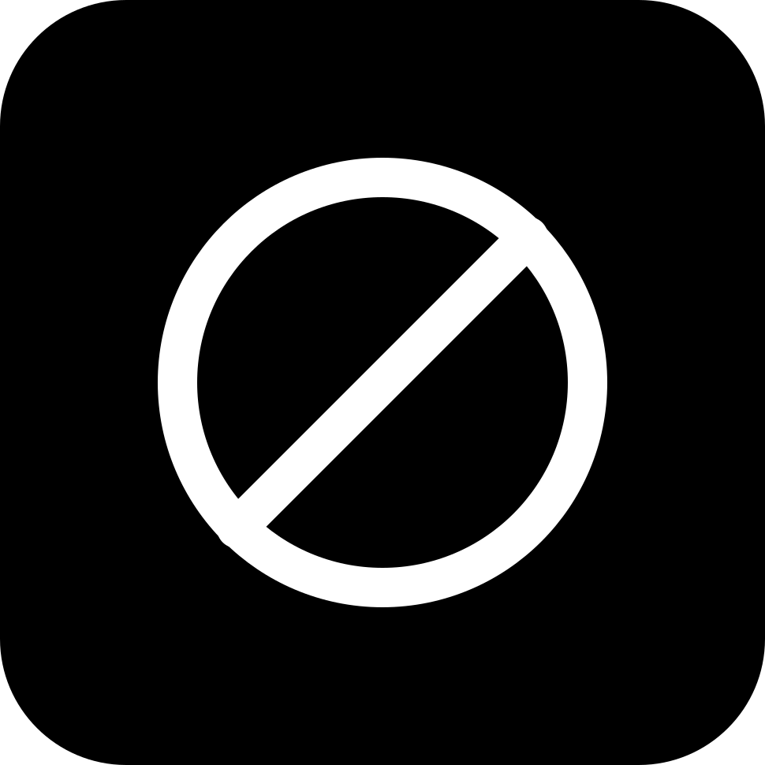

<div align="center">
  
  <h1>gray-tool-gate</h1>
  <p><strong>A persisted deny-list for tools.</strong></p>
  <p>
    <a href="https://gray.alignment.id">Website</a> ·
    <a href="https://gray.alignment.id/plugins/gray-tool-gate">Store</a> ·
    <a href="https://github.com/vstaln/gray-tool-gate">Source</a> ·
    <a href="https://github.com/vstaln/gray">gray</a>
  </p>
  <p>
    <a href="LICENSE"></a>
    <a href="https://www.rust-lang.org"></a>
    <a href="https://gray.alignment.id/plugins/gray-tool-gate"></a>
  </p>
</div>

<br/>

```bash
gray plugin install gray-tool-gate
```

A persisted deny-list for tools. `tool/before` checks every tool call's `name`
against `~/.gray/tool-gate/deny.txt` — one pattern per line, `#` comments,
`*`/`?` globs (`git-*` matches `git-foo`).

A match answers `{"decision":"deny"}` with a reason pointing at
`/gate allow`. This is a guard: it fails closed only on an explicit match —
a missing file denies nothing and a read error is logged to stderr and
allows.

## Commands

- `/gate deny <tool-or-glob>` — add to the deny list
- `/gate allow <tool-or-glob>` — remove (exact entry match)
- `/gate list` — show denied patterns
- `/gate clear` — empty the list

## Wire

`plugin/manifest`, `tool/before`, `command/run`, `plugin/shutdown`.
Protocol 2.0, hook `tool/before`. No capabilities required.

## Install

```sh
gray plugin install tool-gate
```

## Develop

```sh
cargo test
gray account check      # entry point + manifest handshake
gray account publish    # check → build → release → publish to the gray registry
```

Bump `version` in `Cargo.toml` before each `publish`; the registry refuses to
republish a version.

## Tags

`gray` `plugin` `tool-gate` `rust`

---
Part of the [gray](https://github.com/vstaln/gray) plugin ecosystem —
the open-source AI agent harness. <https://gray.alignment.id>
